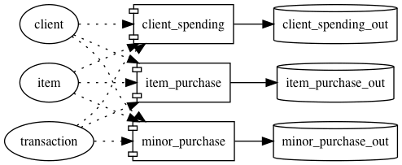

spark-etl-demo
==============

Demo application for [spark-etl](https://github.com/konrads/spark-etl) library.

Build status (master): [](https://travis-ci.org/konrads/spark-etl-demo)

Suggested ba-dev-ops interactions
---------------------------------

### BA:
BA works off the [sql directory in BA branch](../../tree/BA), populating only [app.yaml config](../../tree/BA/src/main/resources/app.yaml) and [resource SQLs](../../tree/BA/src/main/resources). When done, these are merged into master by developer.

### Dev:
Developer merges [BA branch](../../tree/BA) into `master`. Developer initiates the `build`, ensuring `sbt validate-conf test` target passes, as that validates config/SQL, as well as any code tests. This sbt target should also be run within CI, see [.travis.yml](.travis.yml).
The code can then build and published on Spark cluster environment.

This project utilizes library [spark-etl](https://github.com/konrads/spark-etl), please look there for more information.

### Ops:
Once the releasable artefacts are deployed to Spark cluster environment, run with [run.sh](src/main/resources/run.sh):
```
> ./run.sh
  Usage:
    help
    validate-local
    validate-remote
    transform-load
    extract-check
    transform-check
```

*Always* start by running validations:
```
> # check config and SQL
> ./run.sh -Denv.path=<root> validate-local

> # check hdfs paths, other remote connectivity
> ./run.sh -Denv.path=<root> validate-remote
```

To run transform and persist results:
```
> ./run.sh -Denv.path=<root> transform-load
```

To fetch yarn logs after the job is run, set `PACKAGE_LOGS=true`. *Note: not for production!*
```
> export PACKAGE_LOGS=true
> ./run.sh -Denv.path=<root> transform-load

> # list zipped up logs (from driver and from the cluster)
> ls logs/current
logs_application_XXXXXXXXXXXXX_YYYYYY.zip

> cd logs/current
> unzip logs_application_XXXXXXXXXXXXX_YYYYYY.zip
Archive:  logs_application_XXXXXXXXXXXXX_YYYYYY.zip
  inflating: application_XXXXXXXXXXXXX_YYYYYY.local.log
  inflating: application_XXXXXXXXXXXXX_YYYYYY.remote.log
```

Lineage
-------
Following lineage/dependency graph was generated via:
```
sbt genDot
# after graphviz install, eg. brew install graphviz
dot -Tgif src/main/lineage/lineage.dot -o src/main/lineage/lineage.gif
```


#### Legend
* ellipse = extract
* component = transform
* cylinder = load
* full line = relationship configured explicitly
* dotted line = relationship derived from SQL
