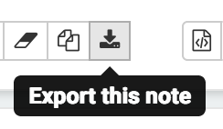

spark-etl-demo
==============

Demo for spark-etl, as driven by BAs and Devs.

BA process
----------

BA workflow starts by working on the Zeppelin notebook [tools/zeppelin/Demo.json](tools/zeppelin/notebook.json) which constitutes a Specification. BA fills in the notebook with:

* mapping of extract locations
* transform SQLs
* optional extract-check
* optional transform-check
* optional report

The notebook can be imported via Zeppelin home page -> "Import note" -> "Choose a JSON here", and exported from the notebook page via:

BA notebook must be runnable via:

Once satisfied with the notebook, BA dissects it into:

* [app.yaml](src/main/resources/spark/app.yaml) - config listing extracts with locations, and transform SQL URIs. Note, extract locations support `${env_vars}`, whilst transform URIs are relative to [src/main/resources](src/main/resources)
* [transform](src/main/resources/spark/transform) SQLs
* optional [extract-check](src/main/resources/spark/extract-check) SQLs
* optional [transform-check](src/main/resources/spark/transform-check) SQLs
* optional [report.sql](src/main/resources/spark/report.sql)

Finally, BA performs pull request, which once accepted, will result in a new build. The build validates config and SQL syntax and will fail if detects errors.
